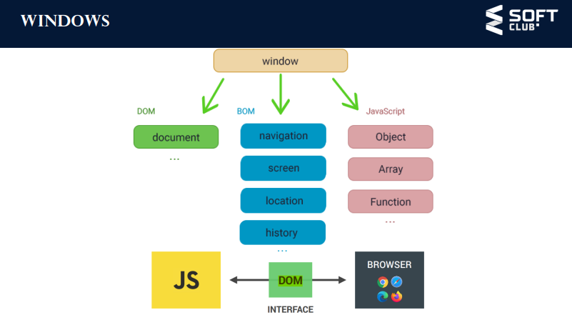

# DOM

## DOM — это наиболее важный компонент функциональности, доступный вам для работы с HTML-документами. Он является тем недостающим звеном, которое связывает HTML и CSS с JavaScript. Помимо этого, он также повышает уровень доступа к браузеру.

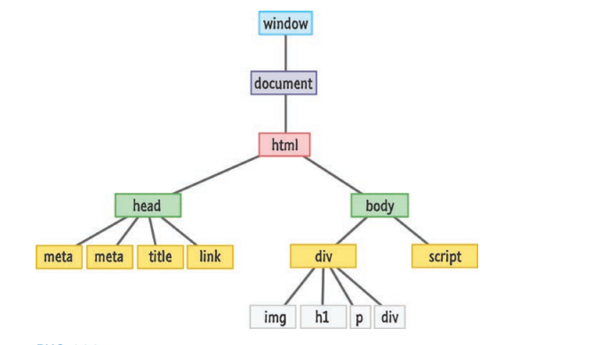

# Методы работа с DOM
## Для получение доступ к элемент DOM 
1. document.querySelector(".clasName") тоько один элемент

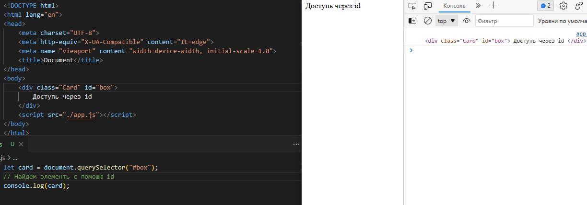

2. document.querySelectorAll("#id" || ".class", || "element") все элементы которые равни в этом  element
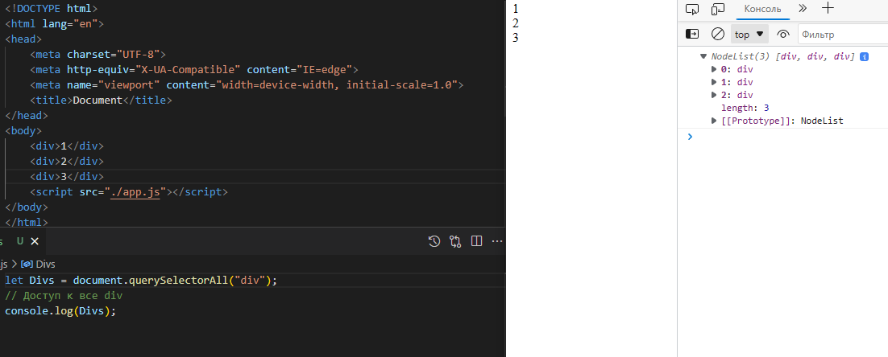

## Для изменение элементы
1. el.innerHTML = "text or HTML element"
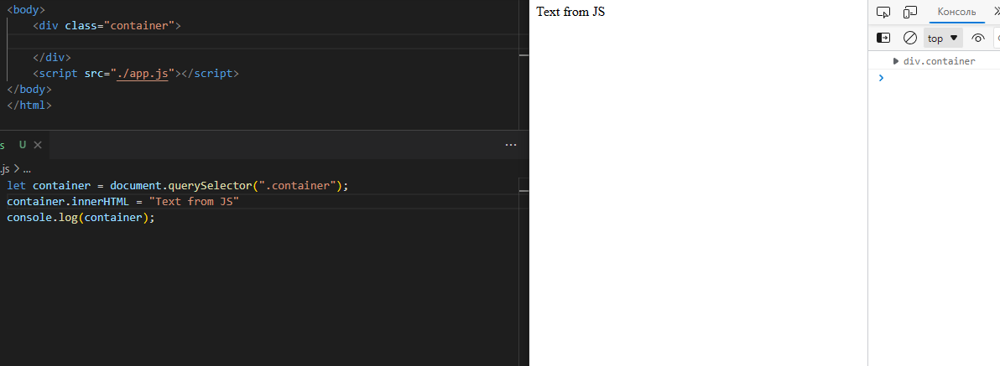
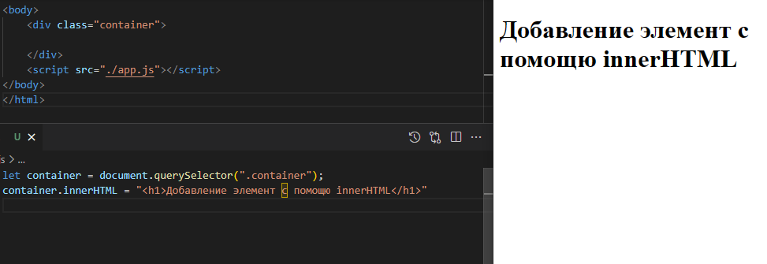
## Для добавьлене элемент в DOM
1. document.createElement("h1")
2. motherDiv.appendChild(child)
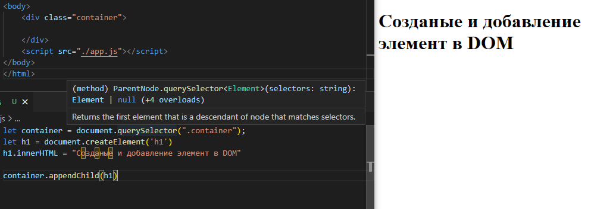

# Стилизация элементы DOM
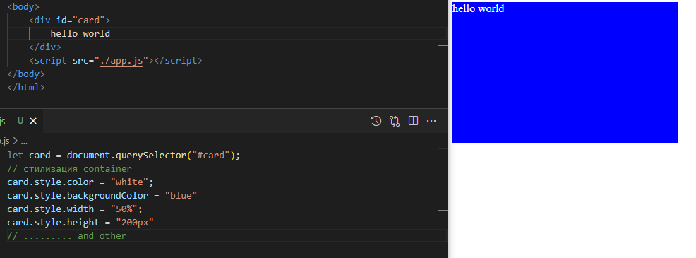

# classList()
## Этот новый API известен как classList. Он предоставляет набор методов, которые упрощают работу со значениями классов:
1. add;
>> Чтобы добавить значение класса элементу, получите ссылку на этот элемент и вызовите для него метод add через classList:
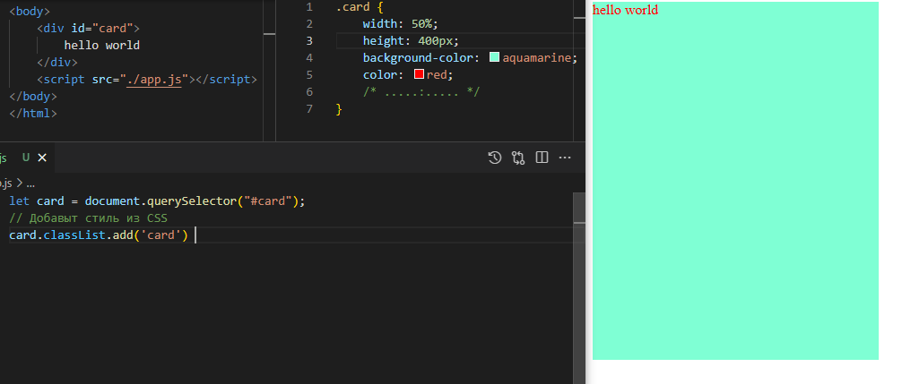
2.  remove;
Для удаления значения класса мы можем вызвать метод remove также через classList:
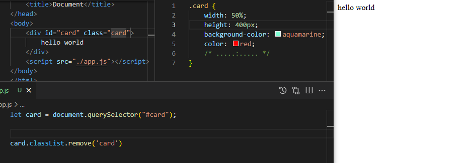
3.  toggle;
Во-первых, мы проверяем, существует ли значение класса в элементе. Если да, мы удаляем его из элемента. Если же нет, то мы, наоборот, его добавляем. Чтобы упростить этот тривиальный шаблон переключения,API classList предоставляет метод toggle:
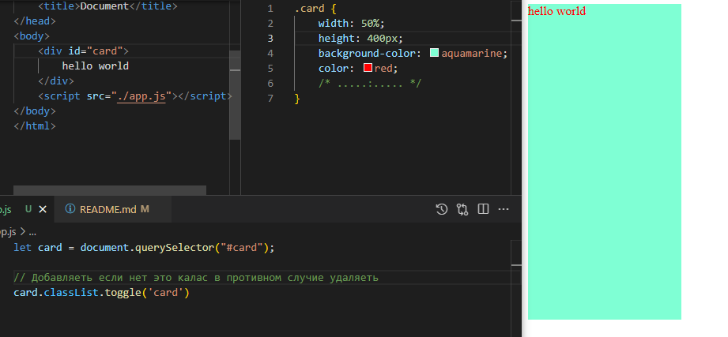

4.  contains
Этот метод проверяет, существует ли указанное значение класса в элементе. Если да, то возвращается true, если нет — false. 
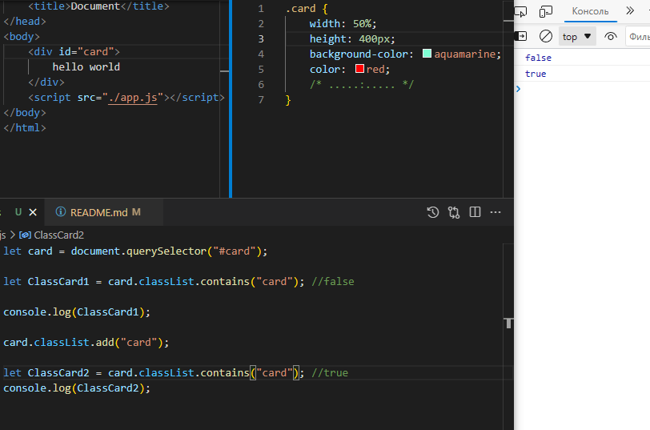